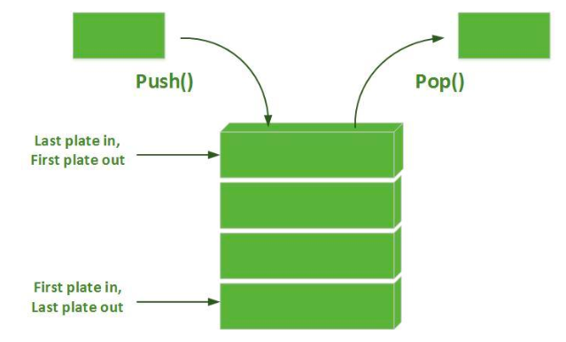

# DSC-IBA | ANDROID BOOTCAMP
# DAY-3 (INTENTS and USER INTERACTION
By Hashaam Masood, Core Team member and Android lead @ DSC-IBA

# Intent Part

## Creating A new Activity
Click on files -> new -> activity -> Empty Activity (or any other activity you want to create

## Intents (Switching between the actitivties)

After creating the new activity, the code on line 24 and 25 indicates the navigation between the activities 

## STACK 

While creating each activity, activity gets in stack and moving from activity to another the stack increases (if finish() is not applied). On pressing back button the the top most activity is loaded and by default the current activity would be finished. Stack is LIFO, last in first out.

## finish() method

The finish method removes the activity from the stack and the back button won't navigate towards the activity on which the finish() method is applied

## onBackpressed() method

By overriding this default method, you can customize the working on this method. As in the picture it is shown that onbackpressed method working default working is changed to displaying the toast.

# Designing Part

##ImageView

steps:
1. copy the image from your pc
2. In the res folder, right click drawable and paste the pciture
3. Inside ImageView use backgroud attribute as shown below to import image
4. set width and height accrodingly

## Background of the Activity

here you can add images or color using the background attribute as show in the image below. It is parent layout(the top most part of xml)

## Vector Image

In this part we wil see how we can add the icons inside our button

Click file -> new -> vector asset

1.The screen below shows the interface of the vector image 
2.By clicking on the clipart you will see numerous icons
3.you can set your dimensions(height and width) and color accordingly.

1. You can use drawable(top, bottom etc) attribute and the xml file name in your drawable folder to import icons (same procedure as image)
2. The code is shown below
3. You can use appropriate padding inside to make it look better

## THEME

Go to your values folder and click styles, the color shown defines your theme. The second item represnts the Action bar(the app bar) 

you can change those colors by navigating inside your colors folder as shown below.

## Set Title

using setTitle() you can change the name of you page which is displayed in action bar

## Image Asset

Here we will see how we can change our icon of the App

Click on file -> new -> Image Asset
the following interface would apper 

CLick on the path and select the image from your pc for icon
you can resize the icon according to different app icons style for e.g (circular, square etc)

## THANKYOU

